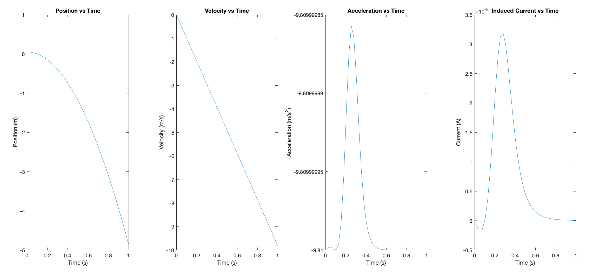

# **Magnetic Braking Simulation**
> *A MATLAB simulation of magnetic braking in a drop tower ride, modeling the deceleration of a freefall gondola through induced eddy currents.*

## **Introduction**
This project simulates the magnetic braking of a gondola in a drop tower ride using a computational model in MATLAB. Drop towers, a popular amusement ride, elevate passengers in a gondola to a high point before releasing them in freefall. Magnetic brakes engage near the bottom, slowing the gondola before it reaches the ground. This simulation models this deceleration process using eddy currents, allowing users to analyze the gondola's velocity and acceleration throughout its descent.

## **Project Description**
- **Main functionality:** Models the dynamics of a magnetic braking system by simulating the freefall and deceleration of a gondola in a drop tower, with graphical representations of key variables over time.
- **Technologies used:** MATLAB, Simulink.
- **Challenges faced:** Accurate modeling of magnetic braking effects and consideration of physical phenomena like eddy currents.
- **Future improvements:** Fine-tuning of model parameters, additional environmental factors, and exploration of practical applications for amusement ride safety.

## **Table of Contents**
1. [Introduction](#introduction)
2. [Project Description](#project-description)
3. [Installation](#installation)
4. [Usage](#usage)
5. [License](#license)

## **Installation**
1. **Prerequisites:**
   - **MATLAB** - [Installation page](https://www.mathworks.com/products/matlab.html)
   - **Simulink** - [Installation page](https://www.mathworks.com/products/simulink.html)

2. **Clone the repository:**
   ```bash
   git clone https://github.com/ivmg5/Magnetic-Braking-Simulation.git
   cd Magnetic-Braking-Simulation
   ```

3. **Open MATLAB and load the file `main.mlx`:**
   1. Navigate to the file location and open it in MATLAB.
   2. Run the file `main.mlx` to start the simulation.

### **Configuration Options**
- Adjust values for constants and variables, such as `r` (loop radius), `N` (number of turns), `R` (resistance), and `m` (mass), within the `main.mlx` file to experiment with different configurations of the braking system.

## **Usage**
Follow these steps to run the simulation:
1. Open the file `main.mlx` in MATLAB.
2. Run the script in MATLAB to generate graphs for analysis.

**Example usage:**
The script will generate the following plots:
- **Position vs Time** (gondola's height during descent)
- **Velocity vs Time**
- **Acceleration vs Time**
- **Induced Current vs Time**

**Example code snippet:**
```matlab
% System initialization
[t, y] = ode45(dydt, [0 tt], [z0; v0]);

% Calculate position, velocity, acceleration, and induced current
z = y(:, 1);
v = y(:, 2);
a = A(z, v);
f = m * a;
I = km.* z.* v./((r * r + z.* z).^ (2.5));
```

**Screenshot:**



## **License**
This project is licensed under the MIT License.

[](#)
[](#)
```
